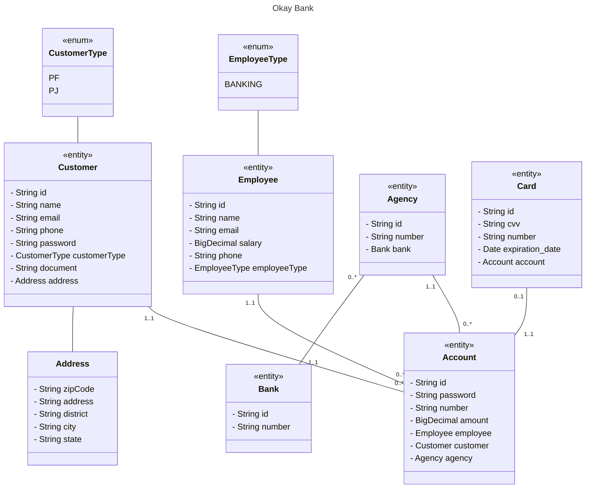

# Okay Bank

Okay Bank app

# Model

```mermaid
---
title: Okay Bank
---
classDiagram
   Employee "1..1" -- "0..*" Account
   Customer "1..1" -- "0..*" Account
   Customer -- Address
   Agency "1..1" -- "0..*" Account
   Agency "0..*" -- "1..1" Bank
   Card "0..1" -- "1..1" Account
   EmployeeType -- Employee
   CustomerType -- Customer    
   
   class Employee {
    <<entity>>
    - String id
    - String name
    - String email
    - BigDecimal salary
    - String phone
    - EmployeeType employeeType
   }
   
   class Address {
    - String zipCode
    - String address
    - String district
    - String city
    - String state
   }
   
   class Customer {
    <<entity>>
    - String id
    - String name
    - String email
    - String phone
    - String password
    - CustomerType customerType
    - String document
    - Address address
   }
   
   class Account {
    <<entity>>
    - String id
    - String password
    - String number
    - BigDecimal amount
    - Employee employee
    - Customer customer
    - Agency agency 
   }
   
   class Card {
    <<entity>>
    - String id
    - String cvv
    - String number
    - Date expiration_date
    - Account account 
   }
   
   class Agency {
    <<entity>>
    - String id
    - String number
    - Bank bank
   }
   
   class Bank {
    <<entity>>
    - String id
    - String number
   }
   
   class EmployeeType {
    <<enum>> 
    BANKING
   }
   
   class CustomerType {
    <<enum>> 
    PF
    PJ
   }
```
